# Issue tracking - v8.0

When a CAFM step fails:

1. Do not clear the session.
2. Click **Download diagnostic JSON**.
3. Click **Download CSV log**.
4. Note what was visible in CAFM (for example: Contract list did not load, PPM Status popup did not open, Save validation appeared).
5. Send the diagnostic JSON and CSV log with the screenshot if available.

The diagnostic JSON is intentionally small and trace-oriented. It stores no CAFM credentials. It identifies the current Asset Code, workbook row, PPM key/index, automation phase, iteration progress, page URL, validation text and recent state transitions.

## Error isolation

- `phase: fill/filling` -> direct field or tab issue.
- `phase: lookup/...` -> dropdown selection or lookup result issue.
- `phase: await_save` -> asset save/validation issue.
- `phase: activate_*` -> Asset Status issue.
- `phase: ppm_*` -> PPM creation/save issue.
- `phase: ppm_status_*` -> PPM Active status issue.

## Resume principle

The importer persists the session after state transitions. Keep the workbook unchanged when troubleshooting a stopped run. Do not start a new bulk run until the failed record has been reviewed.

## Automation state diagram

```mermaid
stateDiagram-v2
  direction LR

  [*] --> navigate: Start Automatic
  navigate --> fill: New Entity page ready
  fill --> filling: Validate row
  filling --> saving: Fields filled
  saving --> await_save: Click Save
  await_save --> asset_close_child: Asset saved
  asset_close_child --> activate_open: Editor closed, parent opens saved asset

  activate_open --> activate_select: Status dialog open
  activate_select --> activate_confirm: Active selected
  activate_confirm --> activate_wait: Confirm clicked
  activate_wait --> ppm_open_list: Asset ACTIVE

  ppm_open_list --> ppm_wait_new: PPM register loaded
  ppm_wait_new --> ppm_fill: New PPM editor open
  ppm_fill --> ppm_await_save: PPM fields filled
  ppm_await_save --> ppm_child_closing: PPM saved (activation skipped)

  ppm_child_closing --> ppm_parent_refresh_wait: Close editor tab
  ppm_parent_refresh_wait --> ppm_next: Parent register refreshed

  ppm_next --> ppm_wait_new: More PPMs for asset
  ppm_next --> navigate: No more PPMs, next asset
  navigate --> [*]: All assets complete

  note right of ppm_next
    Zero linked PPM rows skip
    the PPM loop entirely
  end note
```

